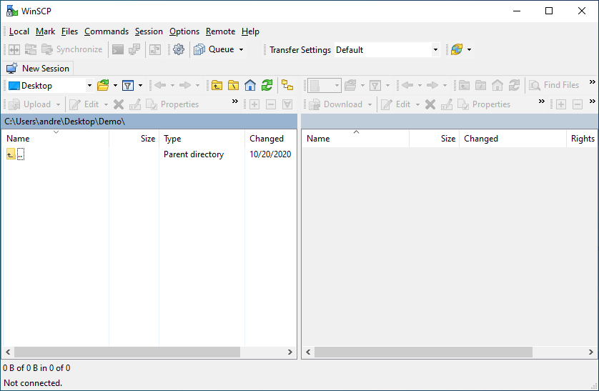
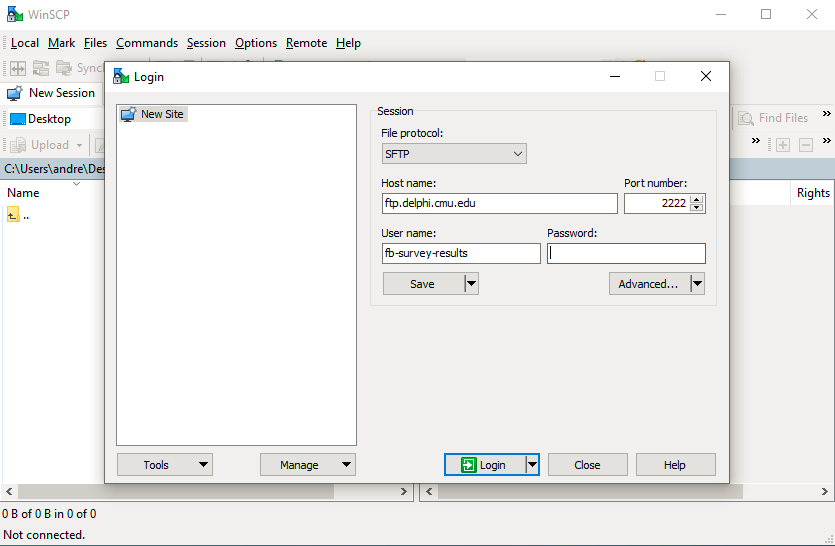
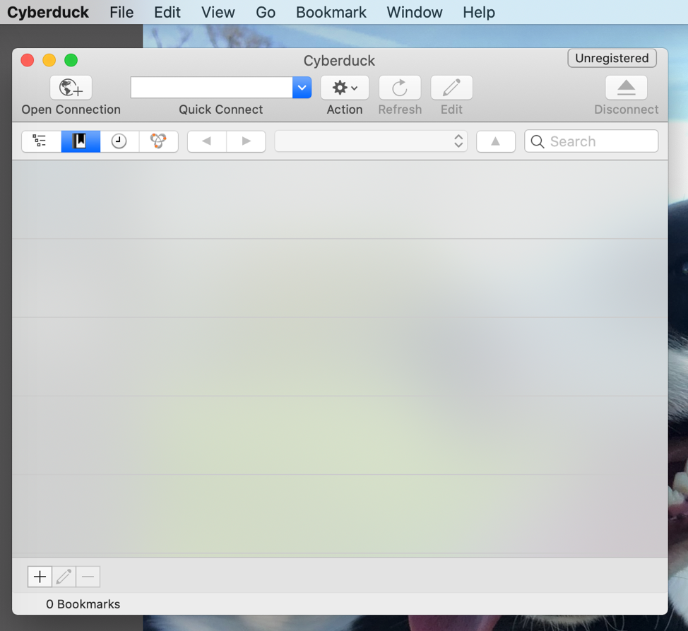
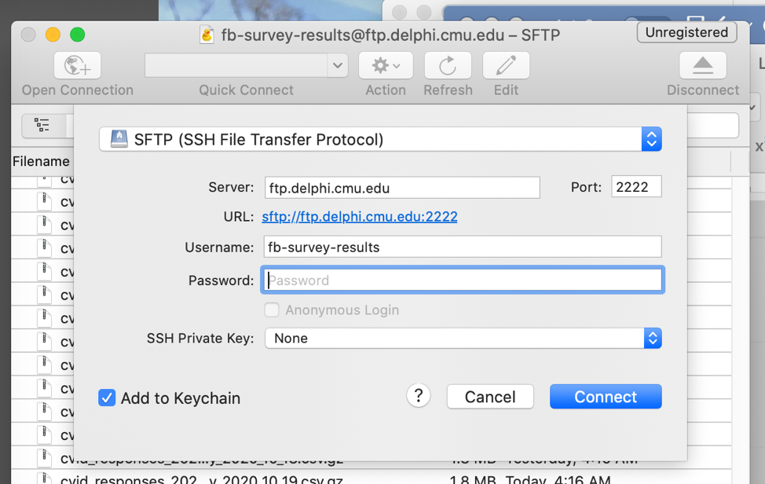

# SFTP Server Access

Researchers with data use agreements to access the raw data from the COVID-19
symptom survey can access the data over SFTP. (If you do not have a data use
agreement, see the [main survey page](index.md) for information about getting
access and about aggregate data that is available for public download.)

If you're not familiar with SFTP, it is a protocol for securely accessing and downloading
large amounts of data from remote servers. The instructions below explain how to
connect to our SFTP server on Windows or Mac. (Linux users can use the
command-line `sftp` program, or most file managers can browse directly to
`sftp://ftp.delphi.cmu.edu:2222` using the username and password provided to
you.)

## Windows

[WinSCP](https://winscp.net/eng/index.php) is a free, open source SFTP client
for Windows. (You can use other SFTP clients if you already have one you
prefer.)

1. Download and install WinSCP.

2. When you open WinSCP, a login window should appear, at which point you can
   move to Step 3. If not, click the “New Session” button in the top left.

   

3. In the login window, make sure SFTP is the selected file protocol and input
   the credentials (server, user, password, and port) given to you in the “CMU
   Delphi COVID Survey Data Access” email. Click “Login” to connect.

   

4. You should then have access to the CSV files of individual responses from CMU
   Delphi COVID Survey of Facebook users. See our [response files documentation](survey-files.md)
   for information on how these files are formatted.

## MacOS

[Cyberduck](https://cyberduck.io) is a free, open source SFTP client for MacOS.
(Download directly from their site for free; the App Store version costs $24.)

1. Once the program is installed, click “Open Connection”.

    

2. Select SFTP (SSH File Transfer Protocol) and input the credentials given to
   you (server, user, password, and port) in the “CMU Delphi COVID Survey Data
   Access” email.

    

3. You should then have access to the CSV files of individual responses from CMU
   Delphi COVID Survey of Facebook users. See our [response files documentation](survey-files.md)
   for information on how these files are formatted.
